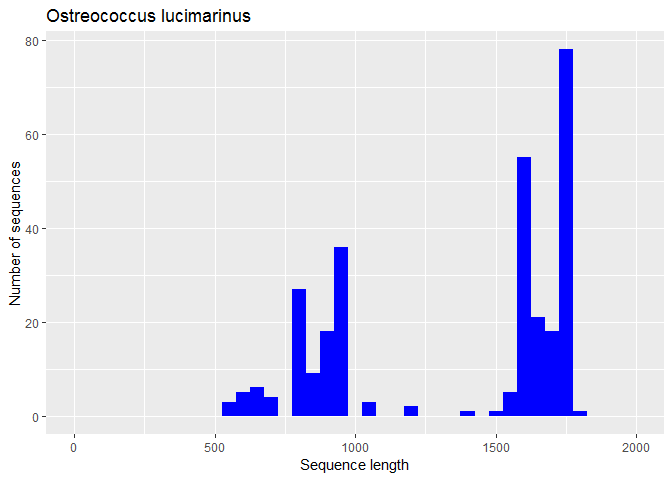
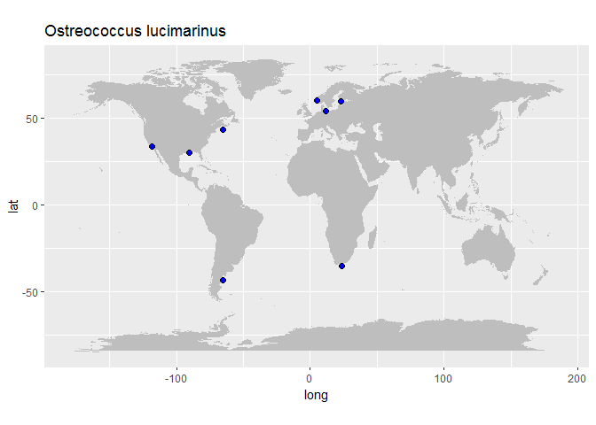
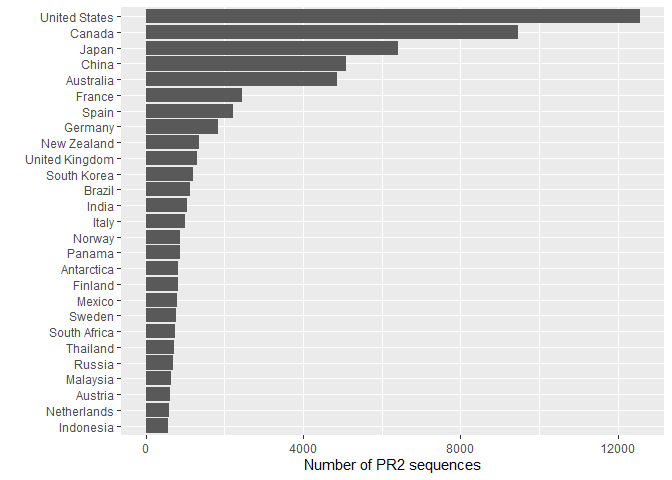
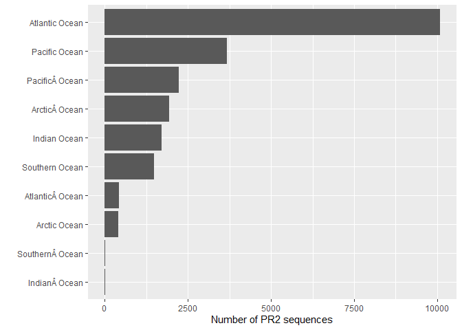

The PR2 database is now provided as a R package

Installation
============

Install from the GitHub web site using the devtools package

``` r
install.packages(devtools)
devtools::install_github("vaulot/pr2database")
```

    * installing *source* package 'pr2database' ...
    ** R
    ** data
    *** moving datasets to lazyload DB
    ** byte-compile and prepare package for lazy loading
    ** help
    *** installing help indices
      converting help for package 'pr2database'
        finding HTML links ... fini
        pr2                                     html  
    ** building package indices
    ** testing if installed package can be loaded
    *** arch - i386
    *** arch - x64
    * DONE (pr2database)
    In R CMD INSTALL

Loading the database
====================

The PR2 database is provided as a data frame (or a tibble). This is a
join between the following tables: \* pr2\_main \* pr2\_taxonomy \*
pr2\_sequence \* pr2\_metadata

``` r
library("pr2database")

data("pr2")

# List of the different columns available - see the help of the package for information on each field

colnames(pr2)
#>  [1] "pr2_main_id"                "pr2_accession"             
#>  [3] "genbank_accession"          "start"                     
#>  [5] "end"                        "label"                     
#>  [7] "gene"                       "organelle"                 
#>  [9] "species"                    "chimera"                   
#> [11] "chimera_remark"             "reference_sequence"        
#> [13] "added_version"              "removed_version"           
#> [15] "edited_version"             "edited_by"                 
#> [17] "edited_remark"              "remark"                    
#> [19] "taxo_id"                    "kingdom"                   
#> [21] "supergroup"                 "division"                  
#> [23] "class"                      "order"                     
#> [25] "family"                     "genus"                     
#> [27] "taxon_trophic_mode"         "taxo_edited_version"       
#> [29] "taxo_edited_by"             "taxo_removed_version"      
#> [31] "taxo_remark"                "reference"                 
#> [33] "seq_id"                     "sequence"                  
#> [35] "sequence_length"            "ambiguities"               
#> [37] "sequence_hash"              "pr2_metadata_id"           
#> [39] "gb_date"                    "gb_locus"                  
#> [41] "gb_definition"              "gb_organism"               
#> [43] "gb_organelle"               "gb_taxonomy"               
#> [45] "gb_strain"                  "gb_culture_collection"     
#> [47] "gb_clone"                   "gb_isolate"                
#> [49] "gb_isolation_source"        "gb_specimen_voucher"       
#> [51] "gb_host"                    "gb_collection_date"        
#> [53] "gb_environmental_sample"    "gb_country"                
#> [55] "gb_lat_lon"                 "gb_collected_by"           
#> [57] "gb_note"                    "gb_references"             
#> [59] "gb_publication"             "gb_authors"                
#> [61] "gb_journal"                 "pubmed_id"                 
#> [63] "eukref_name"                "eukref_source"             
#> [65] "eukref_env_material"        "eukref_env_biome"          
#> [67] "eukref_biotic_relationship" "eukref_specific_host"      
#> [69] "eukref_geo_loc_name"        "eukref_notes"              
#> [71] "pr2_sample_type"            "pr2_sample_method"         
#> [73] "pr2_latitude"               "pr2_longitude"             
#> [75] "pr2_ocean"                  "pr2_sea"                   
#> [77] "pr2_sea_lat"                "pr2_sea_lon"               
#> [79] "pr2_continent"              "pr2_country"               
#> [81] "pr2_location"               "pr2_location_geoname"      
#> [83] "pr2_location_geotype"       "pr2_location_lat"          
#> [85] "pr2_location_lon"           "pr2_country_geocode"       
#> [87] "pr2_country_lat"            "pr2_country_lon"           
#> [89] "pr2_sequence_origin"        "pr2_size_fraction"         
#> [91] "pr2_size_fraction_min"      "pr2_size_fraction_max"     
#> [93] "metadata_remark"
```

Working with the database
=========================

Install and load the libraries
------------------------------

The following examples makes use of the specifc R libraries

Install the libraries

``` r
install.packages("dplyr")      # For filtering the data
install.package("ggplot2")     # To plot data
install.package("maps")        # To plot maps

source("https://bioconductor.org/biocLite.R")  # This package is on Bioconductor
biocLite("Biostrings")         # To save fasta files
```

Load the libraries

``` r
  library(dplyr)
  library(ggplot2)    # For plots
  library(Biostrings) # To save fasta files
```

Selecting sequences from a specific taxon
-----------------------------------------

Let us select all the available sequences for the Mamiellophyceae
*Ostreococcus*

``` r

  # Filter only the sequences for which the column genus contains Ostreococcus
  pr2_ostreo <- pr2 %>% dplyr::filter(genus == "Ostreococcus")

  # Select only the columns of interest
  pr2_ostreo <- pr2_ostreo %>% dplyr::select( genbank_accession, species, 
                                              pr2_sample_type, gb_strain, gb_clone, 
                                              pr2_latitude, pr2_longitude, 
                                              sequence_length, sequence  )
  
  pr2_ostreo
#> # A tibble: 325 x 9
#>    genbank_accessi~ species pr2_sample_type gb_strain gb_clone pr2_latitude
#>    <chr>            <chr>   <chr>           <chr>     <chr>           <dbl>
#>  1 AF525872         Ostreo~ environmental   <NA>      UEPACIp5         NA  
#>  2 EU562149         Ostreo~ environmental   <NA>      IND2.6           NA  
#>  3 AY425309         Ostreo~ environmental   <NA>      RA01041~         NA  
#>  4 GQ426346         Ostreo~ culture         CB6       <NA>             NA  
#>  5 KC583118         Ostreo~ environmental   <NA>      RS.12f.~         NA  
#>  6 JN862906         Ostreo~ culture         BCC48000  <NA>             NA  
#>  7 JQ692065         Ostreo~ environmental   <NA>      PUPF_60         -43.3
#>  8 FR874749         Ostreo~ environmental   <NA>      1815F12          60.3
#>  9 FJ431431         Ostreo~ environmental   <NA>      RA07100~         NA  
#> 10 EU561670         Ostreo~ environmental   <NA>      IND1.11         -35.0
#> # ... with 315 more rows, and 3 more variables: pr2_longitude <dbl>,
#> #   sequence_length <int>, sequence <chr>
```

Exporting the sequences to fasta
--------------------------------

We will save the *Ostreococcus* sequences to a FASTA file. This is easy
done with the bioconductor package BioStrings.

``` r

  # Importing the sequence in a Biostring set 

  seq_ostreo <- Biostrings::DNAStringSet(pr2_ostreo$sequence)

  # Constructing the name of each sequecne (the first line of the fasta file)
  # using the genbank accession, species name, strain name and clone name

  names(seq_ostreo) <- paste(pr2_ostreo$genbank_accession, pr2_ostreo$species,
                             "strain",pr2_ostreo$gb_strain,
                             "clone",pr2_ostreo$gb_clone, 
                              sep="|")

  # Displaying the Biostring set
  seq_ostreo
#>   A DNAStringSet instance of length 325
#>       width seq                                        names               
#>   [1]  1766 ACCTGGTTGATCCTGCCAGT...TGAACCTGCAGAAGGATCA AF525872|Ostreoco...
#>   [2]   836 AAAGCTCGTAGTCGGATTTT...GGGCCGCACGCGCGCTACA EU562149|Ostreoco...
#>   [3]  1728 GCCAGTAGTCATATGCTTGT...AAGTCGTAACAAGGTTTCC AY425309|Ostreoco...
#>   [4]  1652 AGCCATGCATGTCTAAGTAT...ATTACCGTGGGAAATTCGT GQ426346|Ostreoco...
#>   [5]  1764 CCTGGTTGATCCTGCCAGTA...GTGAACCTGCAGAAGGATC KC583118|Ostreoco...
#>   ...   ... ...
#> [321]  1570 CAATTTGAATGAGATTCAAA...AAAAAGACCAAGCCGGAAG KF285522|Ostreoco...
#> [322]  1570 CAATTTGAATGAGATTCAAA...AAAAAGACCAAGCCGGAAG KF285529|Ostreoco...
#> [323]  1570 CAATTTGAATGAGATTCAAA...AAAAAGACCAAGCCGGAAG KF285531|Ostreoco...
#> [324]  1570 CAATTTGAATGAGATTCAAA...AAAAAGACCAAGCCGGAAG NC_008289|Ostreoc...
#> [325]  1570 CAATTTGAATGAGATTCAAA...AAAAAGACCAAGCCGGAAG NC_008289|Ostreoc...
    
  # Saving the sequences as a fasta file
  Biostrings::writeXStringSet(seq_ostreo, "examples/pr2_ostreo.fasta", width = 80)
```

The fasta file will look as follows

    >AF525872|Ostreococcus_lucimarinus|strain|NA|clone|UEPACIp5
    ACCTGGTTGATCCTGCCAGTAGTCATATGCTTGTCTCAAAGATTAAGCCATGCATGTCTAAGTATAAGCGTTATACTGTG
    AAACTGCGAATGGCTCATTAAATCAGCAATAGTTTCTTTGGTGGTGTTTACTACTCGGATAACCGTAGTAATTCTAGAGC
    TAATACGTGCGTAAATCCCGACTTCGGAAGGGACGTATTTATTAGATAAAGACCG...
    >EU562149|Ostreococcus_lucimarinus|strain|NA|clone|IND2.6
    AAAGCTCGTAGTCGGATTTTGGCTGAGAACGGTCGGTCCGCCGTTAGGTGTGCACTGACTGGTCTCAGCTTCCTGGTGAG
    GAGGTGTGCTTCATCGCCACTTAGTCACCGTGGTTACTTTGAAAAAATTAGAGTGTTCAAAGCGGGCTTACGCTTGAATA
    TATTAGCATGGAATAACACCATAGGACTCCTGTCCTATTTCGTTGGTCTCGGGACGGGAGTAATGATTAAGATGAACAGT
    TGGGGGCATTCGTATTTCATTGTCAGAGGTGAAATTCTTGGATTT...
    >AY425309|Ostreococcus_lucimarinus|strain|NA|clone|RA010412.39
    GCCAGTAGTCATATGCTTGTCTCAAAGATTAAGCCATGCATGTCTAAGTATAAGCGTTATACTGTGAAACTGCGAATGGC
    TCATTAAATCAGCAATAGTTTCTTTGGTGGTGTTTACTACTCGGATAACCGT...

Doing an histogram of the sequence length
-----------------------------------------

``` r
  ggplot(pr2_ostreo) + 
    geom_histogram(aes(sequence_length), binwidth = 50, fill="blue") + 
    xlim(0,2000) + xlab("Sequence length") + ylab("Number of sequences") + 
    ggtitle("Ostreococcus lucimarinus")
```



Drawing a map of sequence locations
-----------------------------------

``` r
  library(maps)
  world <- map_data("world")

  ggplot() + 
    geom_polygon(data = world, aes(x=long, y = lat, group = group), fill="grey") + 
    coord_fixed(1.3) +
    geom_point(data=pr2_ostreo, aes(x=pr2_longitude, y=pr2_latitude), fill="blue", size=2, shape=21) + 
    ggtitle("Ostreococcus lucimarinus")
```



Drawing a map of sequence locations obtained by fuzzy matching
--------------------------------------------------------------

A very good tutorial by [Margaret Mars
Brisbin](https://twitter.com/MargaretBrisbin) on how to combine PR2
metadata with Python to locate sequences using all the metadata
information (lat, long, country and fuzzy localization):
<a href="https://maggimars.github.io/eukGeoBlast/eGB.html" class="uri">https://maggimars.github.io/eukGeoBlast/eGB.html</a>
and
<a href="https://github.com/maggimars/eukGeoBlast" class="uri">https://github.com/maggimars/eukGeoBlast</a>.
This code has been used to incorporate more geo-localisation information
into PR2 version 4.12.0


Number of sequences per country
-------------------------------

Version 4.12.0 incorporate better geo-localisation using the approach
pioneered by[Margaret Mars Brisbin](https://twitter.com/MargaretBrisbin)

### Number of sequences per country of origin

``` r
  
  countries <- pr2 %>% 
    count(pr2_country) %>% 
    arrange(-n) %>% 
    filter(!is.na(pr2_country) & n > 500)
  
  ggplot(countries, aes(x = reorder(pr2_country, n), y = n)) + 
    geom_col() +
    coord_flip() +
    xlab("")  + ylab("Number of PR2 sequences")
```



### Number of sequences per ocean of origin

``` r
  
  oceans <- pr2 %>% 
    count(pr2_ocean) %>% 
    arrange(-n) %>% 
    filter(!is.na(pr2_ocean))
  
  ggplot(oceans, aes(x = reorder(pr2_ocean, n), y = n)) + 
    geom_col() +
    coord_flip() +
    xlab("")  + ylab("Number of PR2 sequences")
```


